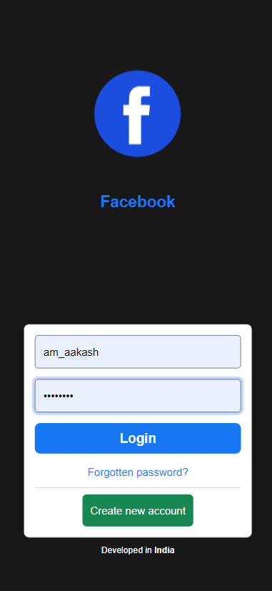
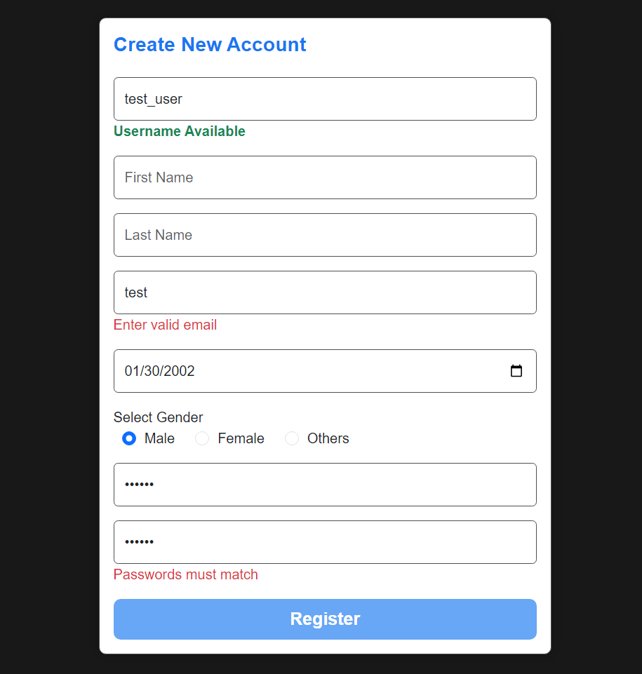
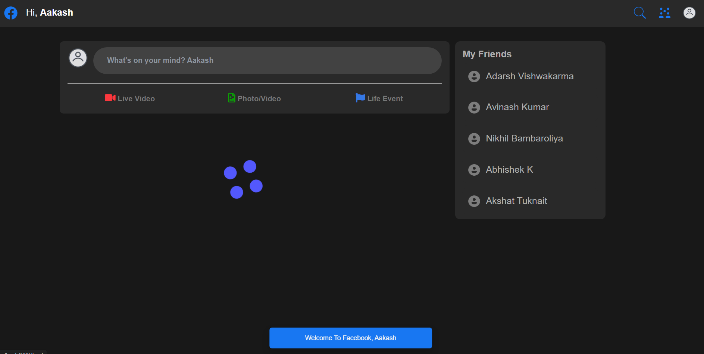
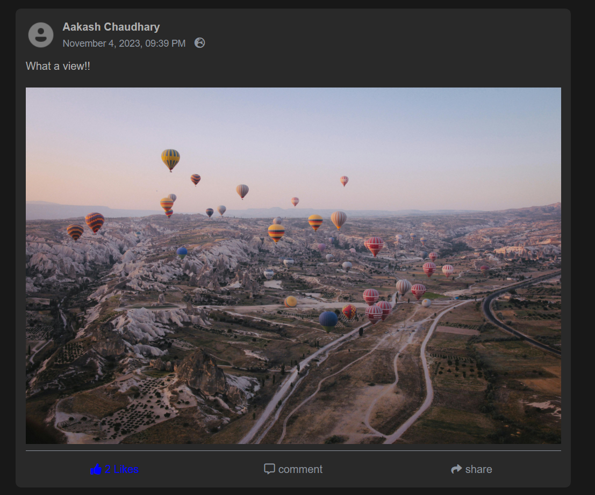
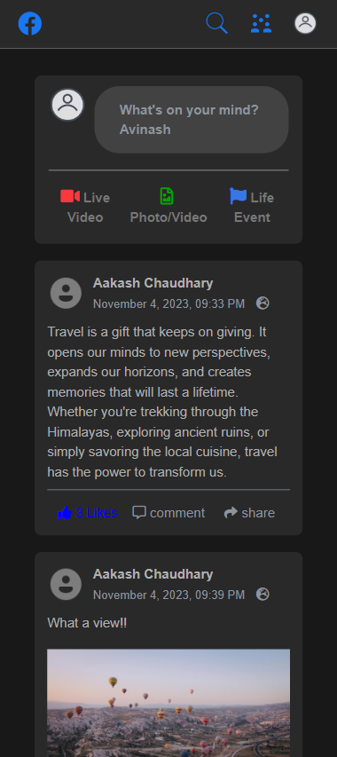
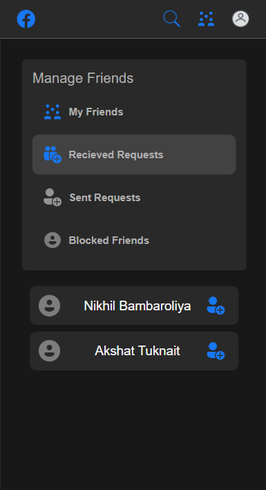
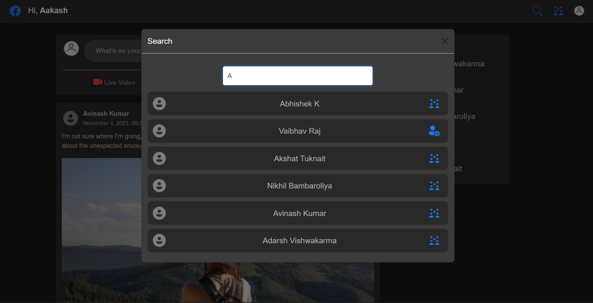
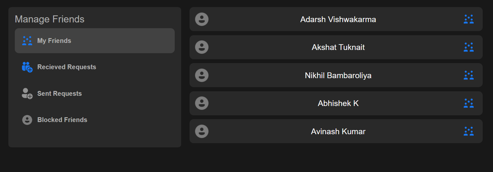
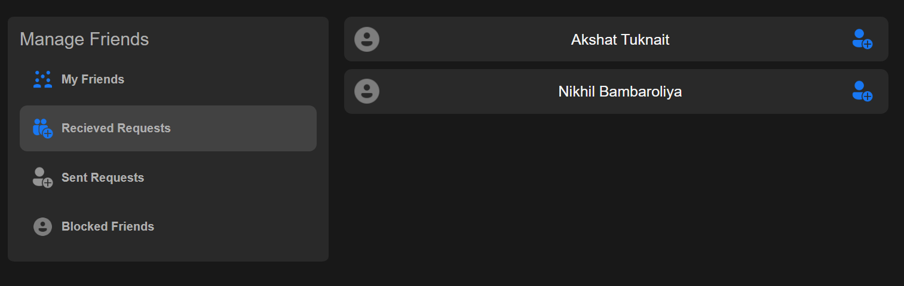

# Facebook

This project was generated with [Angular CLI](https://github.com/angular/angular-cli) version 16.2.8.

## Development server

Run `ng serve` for a dev server. Navigate to `http://localhost:4200/`. The application will automatically reload if you change any of the source files.

## Screenshots

| Screenshot | Description |
|---|---|
|  | Login Small screen |
|  | Register User |
|  | Feed loading |
|  | Post |
|  | Feed Small screen |
|  | Friends Small screen |
|  | Search modal |
|  | Friends |
|  | Requests |